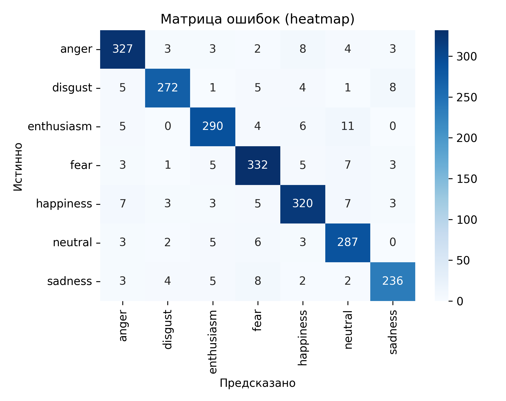
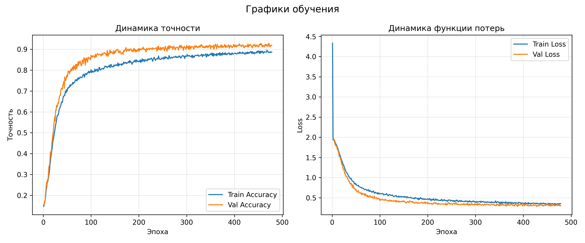

# Отчёт об обучении модели классификации эмоций

## Архитектура модели
```
Model: "sequential"
_________________________________________________________________
 Layer (type)                Output Shape              Param #   
=================================================================
 dense (Dense)               (None, 256)               42752     
                                                                 
 dropout (Dropout)           (None, 256)               0         
                                                                 
 dense_1 (Dense)             (None, 128)               32896     
                                                                 
 dropout_1 (Dropout)         (None, 128)               0         
                                                                 
 dense_2 (Dense)             (None, 64)                8256      
                                                                 
 dropout_2 (Dropout)         (None, 64)                0         
                                                                 
 dense_3 (Dense)             (None, 7)                 455       
                                                                 
=================================================================
Total params: 84359 (329.53 KB)
Trainable params: 84359 (329.53 KB)
Non-trainable params: 0 (0.00 Byte)
_________________________________________________________________
```

## Извлечение признаков
- MFCC (13 коэффициентов) + усреднение по времени
- Chroma STFT
- Mel-спектрограмма
- Спектральный контраст
- Tonnetz
- Все признаки усредняются по временной оси и конкатенируются
### Аугментации
- Добавление шума
- Pitch-shift
- Time-stretch
- Сдвиг по времени
- Изменение усиления (gain)
## Итоги обучения
- Финальная точность (train): 0.8859
- Лучшая точность (train): 0.8962
- Финальная точность (val): 0.9180
- Лучшая точность (val): 0.9292
- Финальная loss (train): 0.3538
- Финальная loss (val): 0.3096
- Минимальная loss (val): 0.2834

## Classification report
| Класс | Precision | Recall | F1-score | Support |
| --- | --- | --- | --- | --- |
| anger | 0.9263 | 0.9343 | 0.9303 | 350.0 |
| disgust | 0.9544 | 0.9189 | 0.9363 | 296.0 |
| enthusiasm | 0.9295 | 0.9177 | 0.9236 | 316.0 |
| fear | 0.9171 | 0.9326 | 0.9248 | 356.0 |
| happiness | 0.9195 | 0.9195 | 0.9195 | 348.0 |
| neutral | 0.8997 | 0.9379 | 0.9184 | 306.0 |
| sadness | 0.9328 | 0.9077 | 0.9201 | 260.0 |
| Macro avg | 0.9256 | 0.9241 | 0.9247 | 2232.0 |
| Weighted avg | 0.9251 | 0.9247 | 0.9248 | 2232.0 |

## Матрица ошибок


## Графики обучения


## Анализ результатов
- Финальная точность: train 88.59%, val 91.80%, лучшая val 92.92%.
- Лучший класс по F1: disgust (0.936).
- Слабейший класс по F1: neutral (0.918).
- Наибольшая путаница: истинный 'enthusiasm' ошибочно классифицируется как 'neutral' (11 раз).
