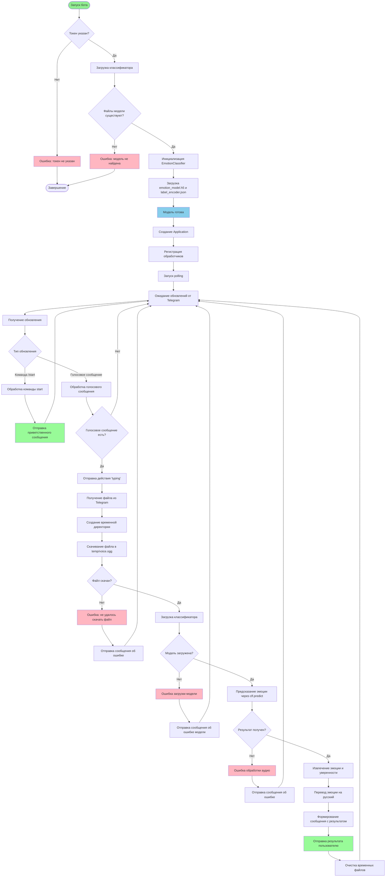

# Блок-схема алгоритма телеграм-бота

## Описание основных блоков

### Инициализация
- **Проверка токена**: Проверяется наличие токена бота (из переменной окружения или кода)
- **Загрузка модели**: При запуске загружается классификатор эмоций из файлов модели
- **Создание приложения**: Инициализация Telegram Application с токеном
- **Регистрация обработчиков**: Регистрация обработчиков для команды `/start` и голосовых сообщений

### Обработка команд
- **Команда /start**: Отправляет приветственное сообщение пользователю

### Обработка голосовых сообщений
1. **Получение сообщения**: Бот получает голосовое сообщение от пользователя
2. **Индикация обработки**: Отправка действия "typing" для уведомления пользователя
3. **Скачивание файла**: Скачивание голосового файла из Telegram во временную директорию
4. **Загрузка модели**: Проверка и загрузка классификатора (если еще не загружен)
5. **Предсказание**: Обработка аудио через метод `predict()` классификатора
6. **Перевод результата**: Перевод названия эмоции с английского на русский
7. **Отправка результата**: Формирование и отправка сообщения с результатом пользователю
8. **Очистка**: Автоматическое удаление временных файлов

### Обработка ошибок
- Ошибки загрузки модели
- Ошибки скачивания файла
- Ошибки обработки аудио
- Все ошибки отправляются пользователю в виде текстовых сообщений

