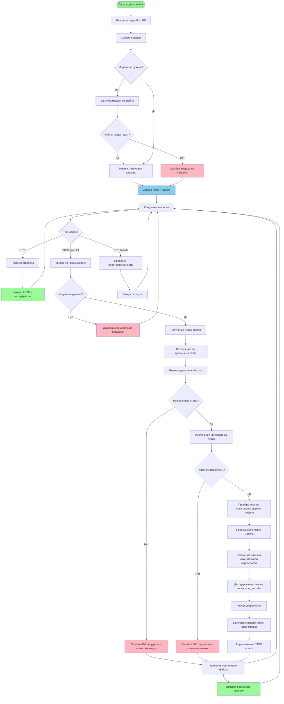

# Блок-схема алгоритма веб-приложения

## Описание основных блоков

### Инициализация
- **Запуск приложения**: FastAPI приложение инициализируется
- **Загрузка модели**: При старте загружается обученная модель из файлов `emotion_model.h5` и `label_encoder.json`

### Обработка запросов
- **GET /** - Возвращает HTML страницу с интерфейсом для записи/загрузки аудио
- **POST /predict** - Обрабатывает загруженный аудио файл и возвращает предсказание эмоции
- **GET /health** - Проверка работоспособности сервера

### Процесс предсказания
1. Получение аудио файла от клиента
2. Сохранение во временный файл
3. Чтение аудио через librosa
4. Извлечение признаков (MFCC, спектральные характеристики)
5. Предсказание через нейронную сеть
6. Декодирование результата и формирование ответа
7. Удаление временного файла

